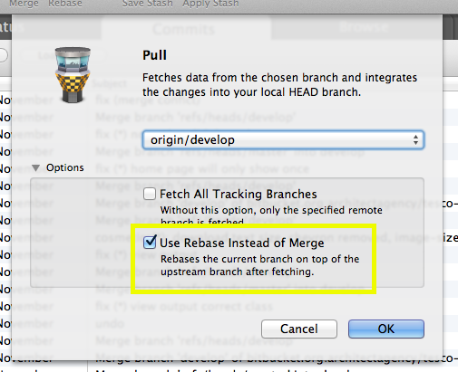

Working with Git
================

1. [Pulling](#pulling)
1. [Assume Unchanged-ing](#assume-unchanged)
1. [Ignore](#ignore)
1. [composer.lock](#composerlock)

Assume Unchanged
----------------

If you have to put any details specific to your local environment or machine or you into a file in your project, you can tell git to ignore any future changes to that file. This is different to a .gitignore, which is for when you don't want to track that a file ever exists.

```bash
git update-index --assume-unchanged path/to/file.m
```

And you can undo this with
```bash
git update-index --assume-unchanged path/to/file.m
```

Pulling
-------

If you’re on the **same** branch as the branch you’re merging in from on the remote, for example you’re merging `origin/develop` into your local `develop` branch, you should use merge with rebase.

Tower:


**NB** This is different to a rebase, do not use Rebase, use Merge with Rebase (confusing I know).

Command line:
```bash
git pull --rebase
```

Ignore
------

The following files should nearly always be ignored:

* npm-debug.log
* composer.phar
* .DS_Store
* .sass-cache
* node_modules
* /vendor

`composer.lock`
---------------

The Composer lock file should be treated differently depending on the status of the project:

- In development: keep the file listed in the `.gitignore` file and never commit. Each developer and server generates its own lock file.

- After launch: once a production server is setup and stable, a `composer.lock` file should be committed. However, this’ll be for production and will not contain things you need to develop with, such as test packages. Therefore after creating the lock file, you should [assume unchanged](#assume-unchanged) and not commit your updates to it.
